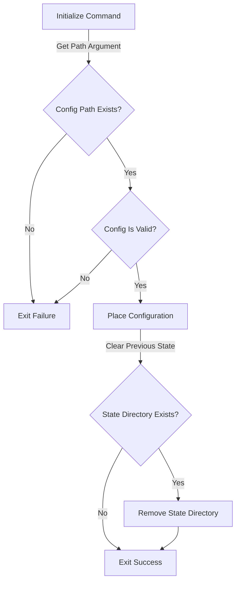
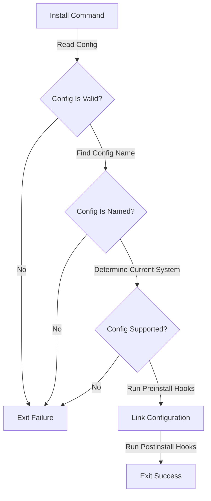
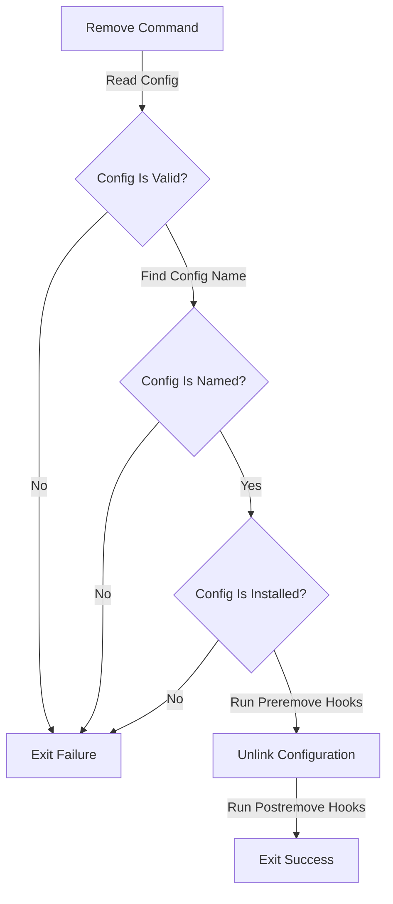
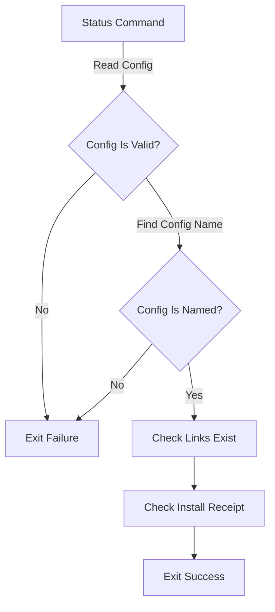
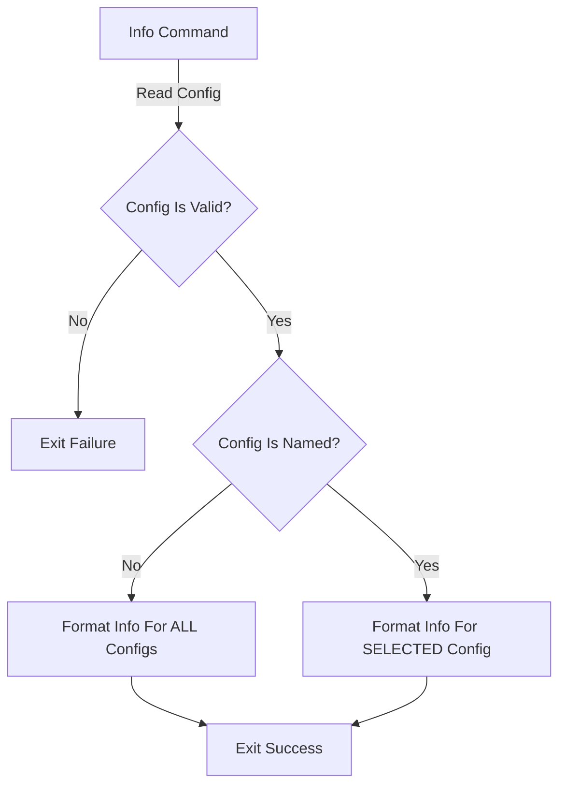

# Logic

## Configuration

### Placement

- Configuration: `~/.dotter/config`
- State information : `~/.dotter/state/*`
  - Installation information stored as `INSTALL.json`

### Validation

Configurations are allowed to be written in [yaml](https://en.wikipedia.org/wiki/YAML) or [json](https://en.wikipedia.org/wiki/JSON), with the former format being preferred. `dotter` will try to parse the configuration file as yaml, then as json. If both parse attempts fail, the configuration is declared to be invalid.

Validation should take place *anytime* the configuration is read to ensure an up-to-date parsing is valid. Once the configuration consists of valid grammar of the available specifications, the keys and values are audited. The audit of keys are values ensures the following

- Valid context use of keys
- Valid types associated with keys

If the context audit fails, the configuration is declared to be invalid. Fixes must be applied before continued use.

## Workflows

The following is a collection of flowcharts that show the execution logic of `dotter`'s commands.

### Setup

### Install

### Uninstall

### Status checks

### Information viewing

